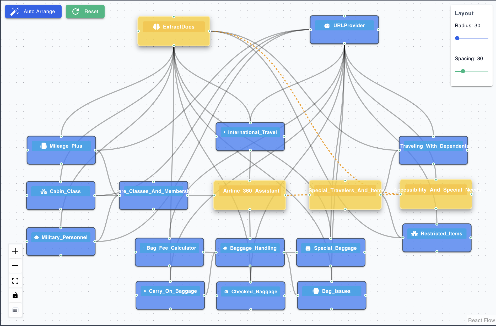
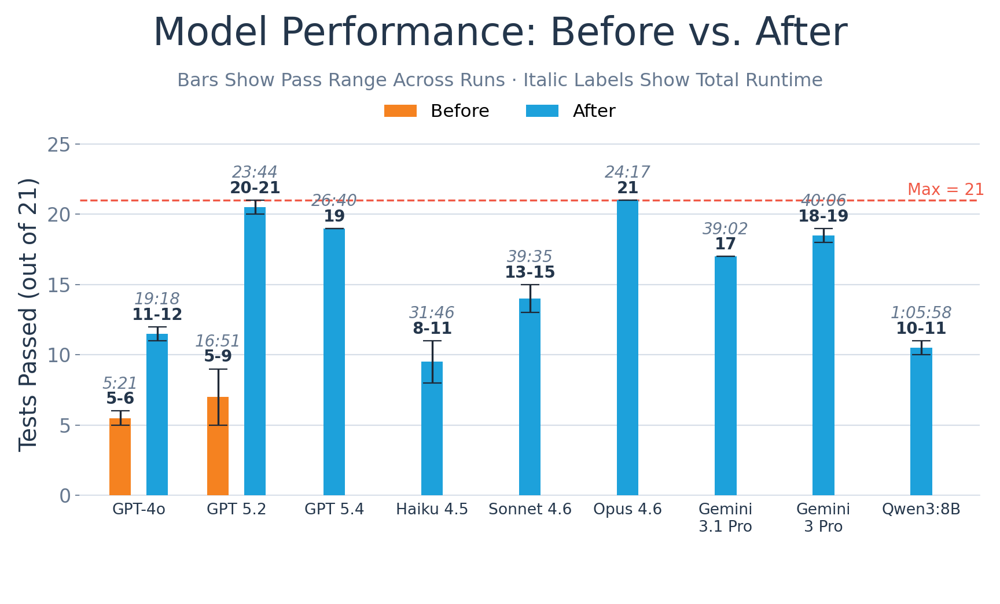

# Testing Agent Networks: Can You Trust What They Return?


Neuro-san-studio's vibe coding support makes building multi-agent systems easier than ever. A working agent network can be assembled from a natural language prompt in minutes. But ease of construction does not guarantee correctness of output. **Can you trust what it returns?**

LLMs hallucinate. Routing agents can send queries to the wrong specialist sub-agent. Responses can be subtly incomplete in ways that are hard to catch manually. Worse, an LLM grounded in documents or tools might bypass them entirely and answer from its own pre-trained knowledge, returning confident but outdated or incorrect responses. To build something truly **dependable**, we built a test framework for Neuro-san-studio.

Our test framework evaluates two dimensions: consistency of correctness across repeated runs, and response time. A slow answer, even a correct one, still loses the user.

To put the framework to its first real test, we chose the airline policy agent network. It answers customer questions about the airline's policies by pulling directly from locally stored policy documents, with each LLM-backed specialist agent owning a clearly scoped slice of the policy knowledge. Questions get routed to the right specialist, and answers get synthesized from multiple sources, effectively a mini RAG system without the infrastructure overhead of vector databases, embedding pipelines, or chunking strategies. It is exactly the kind of grounded, document-driven system where getting answers wrong has real consequences.



The tests surfaced multiple failures we did not expect. Fixing them took significant iteration across different approaches, but the fixes that worked did not just solve the problem for this network. They generalized. Here is what actually worked.


## Bad Knowledge Documents and Vague Descriptions Break Routing

Cleaning up the knowledge documents was the necessary first step. The source text was full of web-scraping artifacts like navigation menus, footer links, and cookie banners. We stripped all of that out and restructured the documents into logical categories, so each agent owns a clearly scoped slice of the knowledge base and queries can be routed to the right specialist with precision.

In Neuro-san-studio, the frontman agent and any sub-agent assigned to route queries decide who to call based on the titles and descriptions of the agents available to them. When those descriptions are missing or buried inside sub-agent instructions, the routing agent has no visibility into what each specialist actually handles. It has no choice but to broadcast every query to all agents, which means wasted calls, wasted time, and wasted tokens. Getting function descriptions right fixes this. A comprehensive, scope-accurate description that captures both what an agent handles and what it does not is what gives the routing agent the precision it needs.

Here is what the difference looks like:

```hocon
// Before: vague description, frontman has no idea what this agent actually covers
{
    name: "Baggage_Info"
    function: ${aaosa_call}{
        description: "Handles baggage related queries"
    }
}

// After: specific description, frontman knows exactly when to invoke this agent
{
    name: "Baggage_Info"
    function: ${aaosa_call}{
        description: """
            Standard bag rules and fees: carry-on size/weight limits/fees,
            personal item size rules, checked bag size/weight limits/fees,
            overweight and oversized bag surcharges.
            Does not cover bag problems after travel, nor non-standard
            items like bikes, firearms, or sports gear.
        """
    }
}
```

With the vague "before" description, a question about bag problems after travel would have incorrectly routed to Baggage_Info, or with no description at all, the routing agent would have had to guess purely from the agent name, leading to frequent misroutes. With the specific "after" description, the routing agent knows exactly what Baggage_Info covers and, just as importantly, what it does not. The improvement in routing accuracy was immediately visible in our test results.


## Five Prompt Patterns That Measurably Improved Accuracy

Now that we had a reliable test framework, every change we made to the agent network had a measurable outcome. That feedback loop is what led us to the techniques below.

**Negative instructions outperformed positive ones every time.** Research is divided on whether positive or negative instructions yield better results with LLMs, but our experience with Neuro-san-studio consistently favored negative instructions.

```hocon
// Before: positive instruction — agents often summarized or skipped edge cases
instructions: """
    Keep all policy documents as-is in your response.
"""

// After: negative instruction — agents consistently return complete answers
instructions: """
    NEVER paraphrase policy language; keep it as-is.
"""
```

**Formatting cues matter more than you think.** Bold markdown formatting and selective use of uppercase made a real difference in how consistently agents followed instructions. Since LLMs process and pass information in markdown format, cues that stand out naturally get more attention. That said, overusing them defeats the purpose. Reserve bold and uppercase for the critical instructions that truly cannot be missed.

```hocon
// Before: plain text — critical rules blend into the prompt
instructions: """
    Never filter or omit policy variations or omit restrictions,
    exceptions, or safety rules.
"""

// After: bold + uppercase on critical constraints — agents follow them more reliably
instructions: """
    **NEVER filter** or omit policy variations or omit restrictions,
    exceptions, or safety rules — return **ALL** of them (by fare class,
    membership status, route, or any other dimension).
"""
```

**Anti-summarization rules were essential for policy content.** LLMs default to summarizing, which is fine for general conversation but a serious problem for policy language. Important qualifications, exceptions, and conditional rules get dropped or reworded in ways that change their meaning. Explicitly instructing agents to preserve the original policy language made a measurable difference on tests that checked for specific conditional rules.

```hocon
instructions: """
    Always include all applicable policy language, conditions, and
    qualifications in full — including all fee amounts, pricing tiers,
    and every step of any multi-step procedure or item lifecycle.
"""
```

**Repeating critical instructions closed the last gap.** The well-documented "lost in the middle" effect means instructions placed in the center of a long prompt are more likely to be ignored. Placing critical rules at both the beginning and end of agent instructions measurably improved consistency. The other techniques do the heavy lifting, but repeating key constraints is what takes the system from 90% to 95%, and in a production system, that margin matters.

```hocon
// instructions_prefix holds the network's most critical rules as a shared variable
instructions_prefix: """
    ...critical rules defined once...
"""

// Each agent sandwiches its own logic between two copies of the prefix
instructions: ${instructions_prefix} """
    You are the Carry On Baggage agent.
    You handle carry-on and personal item rules, size limits,
    and additional items.
    ...agent-specific instructions...
""" ${instructions_prefix}
```

**Explicit tool-call instructions eliminated guessing.** Spelling out the exact tool name, parameter name, and expected value in an agent's instructions led to significantly more consistent tool use. Pairing this with an explicit rule to never use external knowledge closed the loop: agents must call the tool and must base their answer solely on what the tool returns. Without that specificity, agents could fall back on pre-trained knowledge instead of calling the tool, returning confident but wrong or outdated answers.

```hocon
// Before: vague — agents sometimes skip the tool and answer from memory
instructions: """
    Use the document tool to look up the relevant policy.
"""

// After: exact tool name, parameter, and value — agents call it every time
instructions: """
    Always call ExtractDocs (app_name: "Carry On Baggage")
    to get the full policy text. Answer only based on the
    full policy text ONLY.
    **NEVER use external knowledge** — base every answer strictly
    on policy documents or sub-agent responses.
"""
```


## Lessons From Building the Test Framework

**Use prompt optimization tools to iterate faster.** Feeding the current prompt, failing test cases, and expected outputs into a prompt optimizer for the target model accelerated development significantly. Tools like [OpenAI's prompt optimizer](https://platform.openai.com/chat/edit?models=gpt-5&optimize=true) and [Claude's prompt improver](https://claude.ai/public/artifacts/422bb5fc-c03e-4488-9e49-9ad4239398fe) worked well for us. The test framework gave us the objective metrics to confirm whether each change actually helped.

**Let the models teach you where the problem lives.** When iterating on an agent network, run each test 10 times. If a test passes fewer than 3 times, the problem most likely lies in your knowledge documents, tools, or acceptance criteria. The agent is systematically unable to produce the right answer, which means something fundamental is likely missing from the source material. If it passes 4–7 times, the issue typically points to routing: the agent can get it right under some conditions but is not consistently reaching the right specialist. If it passes 8 or more times, the agent is clearly capable of getting it right, but the LLM is just drifting on the remaining runs because the prompt is a little loose. This three-tier diagnostic helps you focus on the right layer instead of guessing.

**Start small and build on what works.** We started with one agent network, wrote a handful of tests, ran them, and learned from the failures. It took significant experimentation to figure out what changes worked, which prompt styles each model responded to, and what it took to get complex queries passing reliably. Once those patterns were clear, applying the same fixes to other agent networks resolved most issues with minimal adaptation.


## Quantifying the Impact: Iteration Gains and Model Comparisons

We wanted to answer two questions: how much did our test-driven iterations actually improve the agent network, and how do different LLMs perform on the exact same network? Same instructions, same agents, same knowledge documents. Just swap the model.

We ran our 21-test airline policy suite across nine models: GPT-4o and GPT-5.2 from OpenAI, Claude Haiku 4.5, Sonnet 4.6, and Opus 4.6 from Anthropic, Gemini 3.1 Pro, Gemini 3 Pro, and Gemini 3 Flash from Google, and Qwen 3 (8b). Each test was run 10 times, and for a test case to pass, we required a perfect 10/10 score.

To show the impact of the iteration process, we evaluated the two OpenAI models twice: once on the original, untuned prompts and once after all test-driven improvements. GPT-5.2 went from passing just 5–9 tests to passing 20–21, purely through prompt changes guided by the test results.

With the agent network tuned, we then ran the full comparison across all nine models. The results were strong across the board. The leading models from each provider passed between 17 and 21 tests, with failures limited to just 1 or 2 runs out of 10. Claude Opus 4.6 achieved the best overall result, passing all 21 tests, with GPT-5.2 a close second. Figure 2 shows the full breakdown.



One advantage of this evaluation is matching the right model to the right use case, enabling decisions grounded in the actual shape of your queries rather than generic benchmark scores. For instance, straightforward questions scoped to a single agent's domain are handled well by GPT-5.2, which routes directly to the right specialist without unnecessary calls. In contrast, questions that span multiple agents and require synthesizing information across sources are where Claude Opus 4.6 shines, handling larger contexts more effectively and producing more complete answers. The choice also depends on practical constraints: token availability per provider, budget, and acceptable latency.


Together, these techniques — **clean knowledge**, **precise descriptions**, **targeted prompts**, and **the right model** — give you everything you need to build an agent network that performs reliably.

## What's Next: Testing Built Into the Builder

Building a test framework manually takes effort, and we know that. But the value it provides is too significant to treat as optional. Currently, we are working on an agent system that automatically generates test frameworks for agent networks, integrated directly into Neuro-san-studio's network builder. When you vibe code a network, you will get a ready-to-run test framework alongside it. No separate setup, no manual test writing to get started. A network and its test framework, ready to run from day one.

*This post focuses on the practical testing work. For the conceptual foundations behind the framework, see Daniel Fink's [Building Confidence in Agent Networks: Agents Testing Agents in Neuro SAN](https://www.cognizant.com/us/en/ai-lab/blog/agent-networks-testing-framework-neuro-san).*